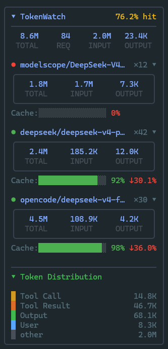

# opencode-tokenwatch

[English](./README.en.md) · **简体中文**



OpenCode CLI 的实时 Token 用量统计、缓存分析与性能指标插件。

## 功能

- **侧边栏面板** — 会话级与按模型的实时统计（请求数、Token、缓存、成本）
- **智能排序** — 模型按最近调用时间降序排列，当前焦点模型始终在顶部
- **供应商名称截断** — 超长供应商名自动截断（12 字符），避免撑破布局
- **缓存命中率** — 模型行内彩色进度条，带趋势指示器（↑/↓），全局总计行显示**加权命中率**
- **性能指标** — TTFT / TPS / 端到端延迟 + P50/P95/P99 延迟分位数
- **Token 分布** — 5 桶角色分解（system / user / toolCall / toolResult / output + other 兜底）
- **错误率统计** — 识别并统计失败请求（空 Token 响应），实时计算错误率
- **无效数据过滤** — 全链路防御：从 perf-tracker 到 sidebar、HTML 报告均过滤全零 token 无效请求
- **成本展示** — 按模型显示 cost（需 provider 返回计费数据）
- **`/usage` 命令** — HTML 报告 → JSON 导出 → 文本报告 → 设置
- **HTML 报告** — 交互式 ECharts 仪表盘：Token 分布、性能分位数、TPS 水平排名、错误率分析，自动在浏览器打开
- **持久化统计** — 性能指标（TPS/TTFT/延迟）写入独立 JSON 文件，永久累积，不受日志轮转影响
- **多级折叠** — 面板、模型、子区块均可折叠，状态持久化
- **语言切换** — 中英双语，跟随系统或手动切换

## 安装

```sh
npm install opencode-tokenwatch
```

在 `opencode.json` 或 `opencode.jsonc` 中添加：

```json
{
  "$schema": "https://opencode.ai/config.json",
  "plugin": ["opencode-tokenwatch"]
}
```

## 配置

```jsonc
{
  "plugin": ["opencode-tokenwatch"],
  "pluginConfig": {
    "opencode-tokenwatch": {
      "sidebar": {
        "showPerformance": true,
        "showPricing": true,
        "showTokenDistribution": true,
        "showTrend": true
      },
      "language": "auto"
    }
  }
}
```

| 配置项 | 类型 | 默认值 | 说明 |
|--------|------|--------|------|
| `sidebar.showPerformance` | boolean | `true` | 显示 TTFT/TPS/延迟 |
| `sidebar.showPricing` | boolean | `true` | 显示请求成本 |
| `sidebar.showTokenDistribution` | boolean | `true` | 显示 Token 分布 |
| `sidebar.showTrend` | boolean | `true` | 显示趋势指示器 |
| `language` | `"auto"` / `"zh"` / `"en"` | `"auto"` | 界面语言 |

运行时也可通过 `/usage` → 设置 调整，优先级高于 `pluginConfig`。

## 用法

在 OpenCode TUI 中输入 `/usage`，选择：

- **HTML 报告** — 选择日期范围，生成仪表盘并在浏览器打开
- **JSON 导出** — 导出完整用量数据至 `~/.opencode/reports/`
- **文本报告** — 导出 Markdown 格式至 `~/.opencode/reports/`
- **设置** — 开关侧边栏显示项、切换语言

## 数据文件

| 文件 | 路径 | 说明 |
|------|------|------|
| JSONL 日志 | `~/.opencode/tokenwatch.jsonl` | 原始请求日志，超 5MB 自动轮转 |
| 聚合统计 | `~/.opencode/tokenwatch-stats.json` | 持久化性能统计，永久累积 |
| 报告输出 | `~/.opencode/reports/` | HTML / JSON / Markdown 报告 |

## 系统要求

- OpenCode CLI（支持 `opencode db` 命令）
- Node.js 18+

## 构建

```sh
npm install
npm run build
```

## 相关项目

- [opencode-throughput](https://github.com/Howardzhangdqs/opencode-throughput) — 实时 LLM 性能监控，采集 TTFT/TPS/延迟和成本
- [opencode-visual-cache](https://github.com/Hotakus/opencode-visual-cache) — TUI 侧边栏缓存命中率可视化，Token 分布分析
- [magic-context](https://github.com/cortexkit/magic-context/) — 缓存感知的无限上下文 + 跨会话记忆系统

## 许可

MIT
